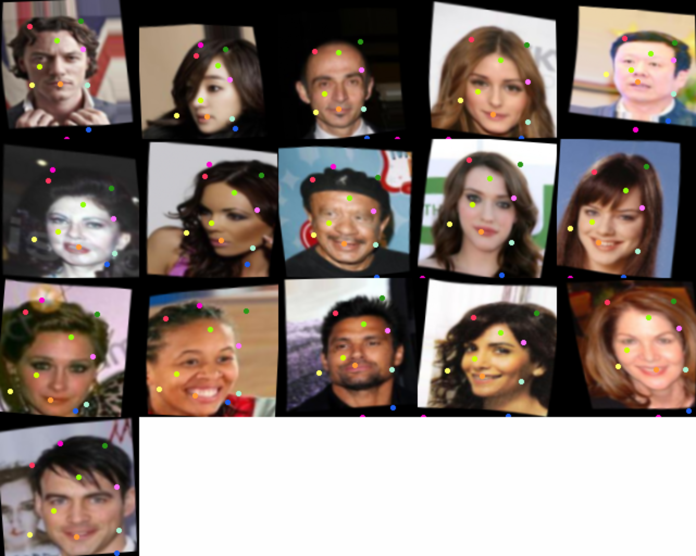
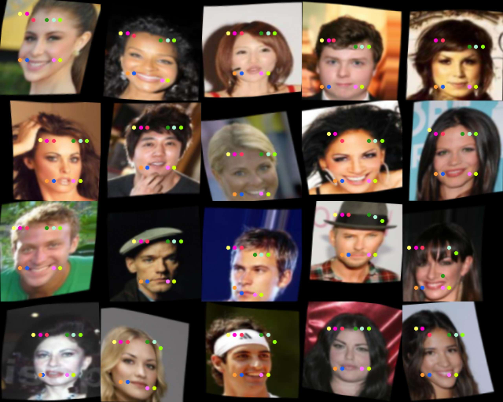

Replication of

# [Unsupervised Learning of Object Landmarks through Conditional Image Generation](http://www.robots.ox.ac.uk/~vgg/research/unsupervised_landmarks/)

[Tomas Jakab*](http://www.robots.ox.ac.uk/~tomj), [Ankush Gupta*](http://www.robots.ox.ac.uk/~ankush), Hakan Bilen, Andrea Vedaldi (* equal contribution).
Advances in Neural Information Processing Systems (NeurIPS) 2018.

and a partial replication of 

# [Unsupervised Learning of Object Keypoints for Perception and Control](https://arxiv.org/abs/1906.11883)

Tejas Kulkarni, Ankush Gupta, Catalin Ionescu, Sebastian Borgeaud, Malcolm Reynolds, Andrew Zisserman, Volodymyr Mnih.  *Unsupervised Learning of Object Keypoints for Perception and Control*.  NeurIPS 2019.  [\[arXiv\]](https://arxiv.org/abs/1906.11883).

in Pytorch by Duane

### result samples

conditional image generation (Tomas and Ankush et al)



transporter network (Ankush et al)



### installing

requires python 3.6 and NVIDIA apex

windows not supported

```
git clone https://github.com/duanenielsen/keypoints
python3 -m venv ~/.venv/keypoints
. ~/.venv/keypoints/activate
cd keypoints
pip3 install .
```

NVIDIA apex is required to run, open an issue if you would like me to make it optional

http://github.com/NVIDIA/apex

follow the apex readme to install

### install celeba dataset

learning keypoints on faces requires celeba dataset, download https://drive.google.com/open?id=0B7EVK8r0v71pZjFTYXZWM3FlRnM

extract to directory as below...

```
keypoints/data
├── celeba-low
│   └── img_align_celeba
│       ├── 000001.jpg
│       ├── 000002.jpg
│       ├── 000003.jpg
```

### running

pong example with 16 bit precision

```
python3 transporter.py --run_id 2 --config configs/transporter_pong_grey.yaml
```

if you dont have RTX card, or can't be bothered with mixed precision you can disable it, but you may need to adjust minibatch size, use the flags

```
--opt_level O0 --batch_size 16
```

if you get GPU memory errors, reduce batch size until it fits on your card

tensorboard files and checkpoints are saved to data/models

2 checkpoints are saved during runs

checkpoint - the latest version of the model during training
best - the model that acheived the best test loss during training

##### reproduce Jakab and Ankush et al on celeba

```
python3 keypoints.py --run_id 3 --config configs/keypoints_celeba.yaml 
```

##### train Ankush et al Transporter network on celeba

```commandline
python transporter.py --run_id 1 --config configs/transporter_celeba.yaml
```

### basic command usage

```
python3 keypoints.py --run_id 1 --config configs/keypoints.yaml
```

### useful command line switches

run on a specific cuda device

```
--device cuda:1
```

run in 32 bit precision

```
--opt_level O0
```

display the run live, update display every 100 minibatches

```
--display --display_freq 100
```

load from checkpoint files in directory

```
--load data/models/VGG_PONG_LAYERNECK/run_1/checkpoint
```

run a saved model in demo mode (don't train, and display live results)

```
--load data/models/VGG_PONG_LAYERNECK/run_1/best --demo --display --display_freq 5
```
